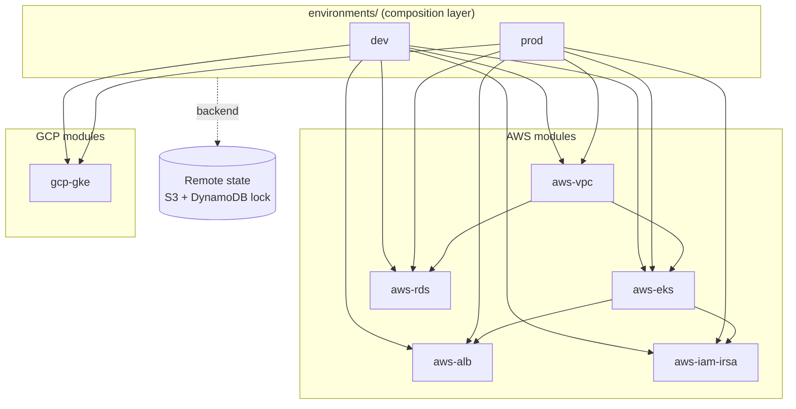

# terraform-aws-gcp-platform

[](https://www.terraform.io/)
[](https://aws.amazon.com/)
[](https://cloud.google.com/)
[](LICENSE)

A reusable, multi-cloud **Terraform module library** for standing up production-grade
infrastructure on **AWS** and **GCP** from the same composition layer. Built to
standardize environment provisioning, cut deployment turnaround, and keep dev and prod
configuration-identical apart from sizing.

> Mirrors the multi-cloud Terraform module work I do day-to-day as a Senior SRE:
> reusable modules, remote state, least-privilege IAM, and a `validate` gate in CI.

## Architecture



## What's inside

| Module | Cloud | Purpose |
|--------|-------|---------|
| `modules/aws-vpc` | AWS | VPC with public/private subnets across 3 AZs, NAT, flow logs |
| `modules/aws-eks` | AWS | EKS cluster + managed node groups, OIDC provider, autoscaling tags |
| `modules/aws-rds` | AWS | Multi-AZ Postgres/MySQL, encrypted, secret in Secrets Manager |
| `modules/aws-alb` | AWS | Application Load Balancer + target groups + WAF association |
| `modules/aws-iam-irsa` | AWS | Least-privilege IRSA roles for in-cluster workloads |
| `modules/gcp-gke` | GCP | Regional GKE cluster with Workload Identity + autoscaling node pools |

## Usage

```hcl
# environments/dev/main.tf
module "vpc" {
  source   = "../../modules/aws-vpc"
  name     = "compliance-dev"
  cidr     = "10.20.0.0/16"
  az_count = 3
  tags     = local.tags
}

module "eks" {
  source             = "../../modules/aws-eks"
  cluster_name       = "compliance-dev"
  kubernetes_version = "1.29"
  subnet_ids         = module.vpc.private_subnet_ids
  node_groups = {
    general = { instance_types = ["t3.large"], min = 2, max = 6, desired = 3 }
  }
  tags = local.tags
}
```

```bash
cd environments/dev
terraform init
terraform plan  -var-file=terraform.tfvars
terraform apply -var-file=terraform.tfvars
```

## Conventions

- **Remote state** in S3 with a DynamoDB lock table (`environments/*/backend.tf`).
- **Least privilege**  IAM via IRSA, no node-wide policies; RDS credentials live in Secrets Manager, never in state output as plaintext.
- **Tagging**  every resource carries `Environment`, `Owner`, `ManagedBy=terraform`, `CostCenter`.
- **`terraform fmt` + `validate`** enforced in CI on every PR (`.github/workflows/terraform.yml`).

## Repo layout

```
modules/        # reusable building blocks (one concern each)
environments/   # dev + prod compositions wiring modules together
examples/       # minimal runnable example per module
```

## License

MIT © Ayushi Shrotriya
